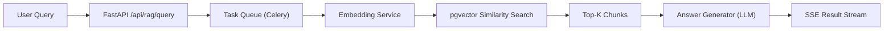

<div align="center">

# 🌟 AstraMind

### *Deterministic Analytics & Governed Generative Intelligence*

**An intelligent system that guides users through data and knowledge with clarity, trust, and control.**

[](https://youtu.be/_nD_N5I1nas)

---

</div>

## 🎯 What is AstraMind?

AstraMind is an **enterprise-grade Natural Language Analytics & AI Assistant platform** that shifts from probabilistic LLM outputs to **deterministic execution**. By routing queries through a structured Abstract Syntax Tree (AST), the system ensures every result is explainable, auditable, and safe for high-stakes business environments.

### ✨ Core Value Propositions

- **🎯 Zero Hallucination Risk** – AST-driven architecture eliminates SQL hallucinations
- **📊 Native Auditability** – Every result traces back to specific metrics, dimensions, and source tables
- **🔒 Enterprise-Grade Governance** – Built-in safety filters, PII redaction, and prompt injection defense
- **🌍 Language-Agnostic** – Multilingual support (EN/ES/HI) without re-architecting
- **🧩 Explainability by Construction** – Structured QueryAST replaces raw chat history
- **📈 Intelligent Visualization** – Charts derived from query intent, not just data

---

## 🏗️ The Deterministic Flow: From Language to Logic

<div align="center">


*AstraMind converts natural language into validated QueryAST, ensuring deterministic SQL generation with zero hallucinations.*

</div>

### Why AST-Driven Beats Naive LLM-Generated SQL

| Feature | ⚠️ Naive LLM-Generated SQL | ✅ AstraMind (AST-Driven) |
|---------|---------------------------|--------------------------|
| **Hallucination Risk** | High ❌ | Zero ✅ |
| **Auditability** | Difficult 📋 | Native / Built-in 🔍 |
| **State Management** | Raw Chat History 💬 | Structured QueryAST 🧩 |

---

## 🚀 Core Design Principles for Enterprise Trust

### 1️⃣ **Explainability by Construction**
Every result is traceable to specific metrics, dimensions, and source tables. No black boxes.

### 2️⃣ **RAG-Backed Generative Intelligence**
Policy Q&A uses retrieval-augmented generation to ensure grounded answers with source citations.

### 3️⃣ **Language-Agnostic Governance**
Safety, PII filtering, and audit-friendly traces apply consistently across all languages.

---

## 📦 Two-Phase Architecture

### Phase 1: Natural Language Query (NLQ) Analytics Engine
- Converts natural language into **deterministic, explainable SQL**
- Supports **conversational context** via AST-based memory
- Produces both **tabular and visual outputs**

### Phase 2: Generative AI Assistant (Extension)
- **RAG-backed summarization**, drafting, and policy Q&A
- Strong **governance, safety, and cost controls**
- **Multilingual support** without re-architecting

Both phases follow the **same architectural philosophy**: LLMs for intent extraction, never for execution.

---

## 🎬 Watch the Demo

[](https://youtu.be/_nD_N5I1nas)

See how AstraMind:
1. Converts natural language to deterministic SQL
2. Handles conversational refinements with explicit context
3. Provides explainability panels for every result
4. Automatically infers optimal visualizations
5. Extends to multilingual AI assistance with RAG

---

## 🔧 Technical Overview

ClarityQL (the codebase powering AstraMind) is a production-grade monorepo that supports multiple NLQ use cases while sharing common infrastructure and domain logic.

**Status:** Core architecture implemented with active development.

## Architecture Summary

- **apps/backend**: FastAPI service exposing NLQ APIs, auth stubs, and schema endpoints.
- **apps/frontend**: Vite + React + TypeScript client with placeholder pages.
- **packages/core**: Framework-agnostic domain modules (schema registry, SQL AST, safety checks, visualization inference, explainability).
- **packages/auth**: JWT helper stubs for shared auth utilities.
- **packages/db**: Database base + migration scaffolding.
- **infra**: Local development infrastructure via Docker Compose.
- **scripts**: Seed utilities for initial data.

## Tech Stack Used

- **Frontend**: React + TypeScript (Vite), Tailwind CSS, Recharts, Zustand, React Query
- **Backend**: FastAPI, Pydantic, SQLAlchemy, Celery, Uvicorn
- **Database**: Postgres + pgvector
- **RAG**: Sentence Transformers, pgvector similarity search
- **Auth**: JWT
- **Infra**: Docker Compose, Redis
- **Testing**: Pytest

## Default Models

- **Default LLM**: Gemini `gemini-2.0-flash` (configurable via `LLMSettings` in `apps/backend/app/core/config.py`)
- **Default Embedding Model**: `intfloat/multilingual-e5-large-instruct` (configurable via `EmbeddingSettings` in `apps/backend/app/core/config.py`)

## System Design — NLQ Pipeline


## System Design — RAG Pipeline



## Future Plans

- Enhance NLQ-to-AST parsing with new SQL method support
- Introduce semantic caching for both NLQ and RAG pipelines
- Improve RAG results using reranking

## Run Locally

### Prerequisites

- Python 3.11+
- Node.js 18+
- Docker (optional, for local Postgres/Redis)
- uv (for Python dependency management)

### Backend

```bash
uv venv
uv sync
cp .env.example .env
uv run --directory apps/backend -- python -m uvicorn app.main:app --reload
```

### Frontend

```bash
cd apps/frontend
npm install
npm run dev
```

### Infrastructure

```bash
docker compose -f infra/docker-compose.yml up
```

### UV Scripts

```bash
./scripts/run_backend.sh
./scripts/lint.sh
./scripts/format.sh
```

## Folder Structure

```
apps/
  backend/      # FastAPI application
  frontend/     # React (Vite + TypeScript)
packages/
  core/         # Domain logic (framework-agnostic)
  auth/         # JWT helpers
  db/           # DB base + migrations
infra/          # Docker Compose
scripts/        # Utility scripts
```
